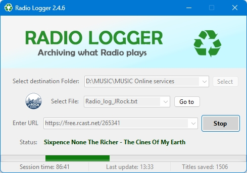

# 🎵 RadioLogger

**RadioLogger** is a Windows application built with **C# (.NET)** for automatically collecting the names of songs played on internet radio streams.

---

## 💡 Purpose

Many online radio stations publish playlists on external websites.  
However, some stations — especially **new or regional ones** — do not provide such playlists.

**RadioLogger** solves this problem by directly connecting to the radio stream and reading **metadata (ID3 tags)**, saving the song titles automatically into a text file.

---

## ⚙️ Key Features

- 🔗 Connect to any internet radio via **stream URL (connection string)**  
- 💾 Save song titles to a specified **.txt file**  
- 🧠 Automatically updates when the track changes  
- 🪟 Modern Windows application interface  

---

## 🖼️ Interface

---

## 🚀 How to Use

1. Enter or paste the **radio stream URL** (e.g., `http://radio.example.com:8000/stream`).
2. Enter the name and location of the **text file** to save. Or select from the predefined ones in the **Settings.ini** file.
3. Click **Start** — the program will begin logging all songs played on the station.  
4. The file updates automatically whenever the song changes.

---

## 🧩 Technologies

- **C# / .NET (Windows Forms / WPF)**  
- **ID3 Tag Reading**  
- **Stream Metadata Parsing**

---

## 📄 License

This project is intended for **personal or educational purposes**.  
It can also serve as a demonstration of C# desktop application development skills.

---

## 👤 Author

**Dmytro**  
Manual & Automation QA Engineer / C# Developer  
🔗 [GitHub Profile](https://github.com/Dku4it)
